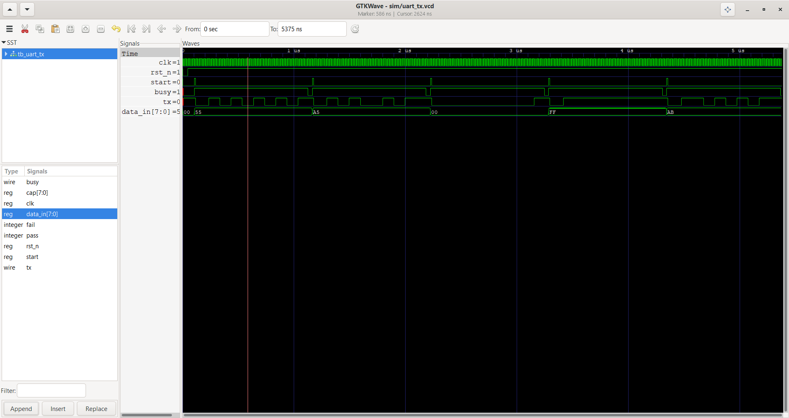

# UART Controller — Verilog HDL

A fully parameterized UART (Universal Asynchronous Receiver-Transmitter) controller implemented in Verilog HDL. Designed, simulated, and verified from scratch as part of a VLSI/RTL design portfolio.

## Features

- Parameterized baud rate and clock frequency — works at any speed
- Full-duplex TX and RX in a single top-level module
- Mid-bit sampling in RX for robust clock recovery
- Glitch rejection on RX input — filters noise shorter than half a bit period
- 2-FF input synchroniser to prevent metastability
- Loopback mode for self-testing without external hardware
- Fully verified with directed testbenches — all test cases passing

## Block Diagram

```
         ┌─────────────────────────────────────────┐
         │              uart_top                   │
         │                                         │
tx_data ─┤→  ┌──────────┐    ┌──────────┐          │
tx_start─┤→  │ uart_tx  │───▶│ uart_rx  │→ rx_data│
         │   │  4-state │ tx │  4-state │→ rx_done │
         │   │   FSM    │    │   FSM    │          │
tx_busy ◀┤─  └──────────┘    └──────────┘          │
         │         ↑               ↑               │
         │    ┌─────────┐   ┌─────────┐            │
         │    │baud_gen │   │baud_gen │            │
         │    │  (TX)   │   │  (RX)   │            │
         │    └─────────┘   └─────────┘            │
         └─────────────────────────────────────────┘
```

## FSM Design

Both TX and RX use a 4-state FSM:

```
TX:  IDLE ──start──▶ START ──tick──▶ DATA ──8 bits──▶ STOP ──tick──▶ IDLE
RX:  IDLE ──rx=0──▶ START ──CPB/2──▶ DATA ──8 bits──▶ STOP ──CPB──▶ IDLE
```

The RX FSM waits half a bit period (CPB/2) before sampling — this centres the sample point inside each bit, maximising noise tolerance.

## File Structure

```
uart_controller/
├── rtl/
│   ├── baud_gen.v      — parameterized baud rate generator
│   ├── uart_tx.v       — transmitter FSM
│   ├── uart_rx.v       — receiver FSM with mid-bit sampling
│   └── uart_top.v      — top-level wrapper (TX + RX)
├── tb/
│   ├── tb_baud_gen.v   — baud generator testbench
│   ├── tb_uart_tx.v    — TX testbench (8 test cases)
│   ├── tb_uart_rx.v    — RX testbench (6 test cases)
│   └── tb_uart_top.v   — full loopback testbench (6 test cases)
├── docs/
│   └── waveform_tx.png — GTKWave simulation screenshot
└── sim/                — VCD waveform output files
```

## Simulation

Tested with Icarus Verilog 12.0 and GTKWave.

**Simulate baud generator:**
```bash
iverilog -g2012 -o sim/baud_gen.out rtl/baud_gen.v tb/tb_baud_gen.v
vvp sim/baud_gen.out
```

**Simulate TX:**
```bash
iverilog -g2012 -o sim/uart_tx.out rtl/baud_gen.v rtl/uart_tx.v tb/tb_uart_tx.v
vvp sim/uart_tx.out
```

**Simulate RX:**
```bash
iverilog -g2012 -o sim/uart_rx.out rtl/baud_gen.v rtl/uart_tx.v rtl/uart_rx.v tb/tb_uart_rx.v
vvp sim/uart_rx.out
```

**Simulate full loopback (TX → RX end to end):**
```bash
iverilog -g2012 -o sim/uart_top.out rtl/baud_gen.v rtl/uart_tx.v rtl/uart_rx.v rtl/uart_top.v tb/tb_uart_top.v
vvp sim/uart_top.out
```

**View waveforms:**
```bash
gtkwave sim/uart_tx.vcd
```

## Test Results

| Module | Test Cases | Result |
|---|---|---|
| baud_gen | 5 | ✅ All passing |
| uart_tx | 8 | ✅ All passing |
| uart_rx | 6 | ✅ All passing |
| uart_top (loopback) | 6 | ✅ All passing |

## Parameters

| Parameter | Default | Description |
|---|---|---|
| `CLK_FREQ` | 50_000_000 | System clock frequency in Hz |
| `BAUD_RATE` | 9_600 | Baud rate in bits per second |
| `LOOPBACK` | 0 | Set to 1 to loop TX back into RX |

**Example — 115200 baud at 50 MHz:**
```verilog
uart_top #(
    .CLK_FREQ  (50_000_000),
    .BAUD_RATE (115_200)
) uart (
    .clk     (clk),
    .rst_n   (rst_n),
    .tx_start(send),
    .tx_data (byte_to_send),
    .tx      (uart_tx_pin),
    .tx_busy (busy),
    .rx      (uart_rx_pin),
    .rx_data (received_byte),
    .rx_done (data_ready)
);
```

## Waveform



*GTKWave output showing TX line with start bit, 8 data bits (LSB first), and stop bit. `busy` signal asserts for the duration of each transmission.*

## Target Hardware

Designed for the **Sipeed Tang Nano 9K** (Gowin GW1NR-9, 27 MHz onboard clock). Constraint file (`.cst`) to be added when board is available.

For Xilinx Vivado or Intel Quartus, only the constraint file changes — all RTL is standard Verilog and fully portable.

## What I Learned

- FSM-based serial protocol design in Verilog
- Baud rate generation using parameterized clock dividers
- Mid-bit sampling for asynchronous clock recovery
- Metastability and 2-FF synchroniser design
- Glitch filtering in digital inputs
- Simulation-driven verification with Icarus Verilog and GTKWave
- Structured RTL project organisation for FPGA deployment

## Author

Janvi Papola — ECE, 2nd Year  
https://github.com/Janvi-00624